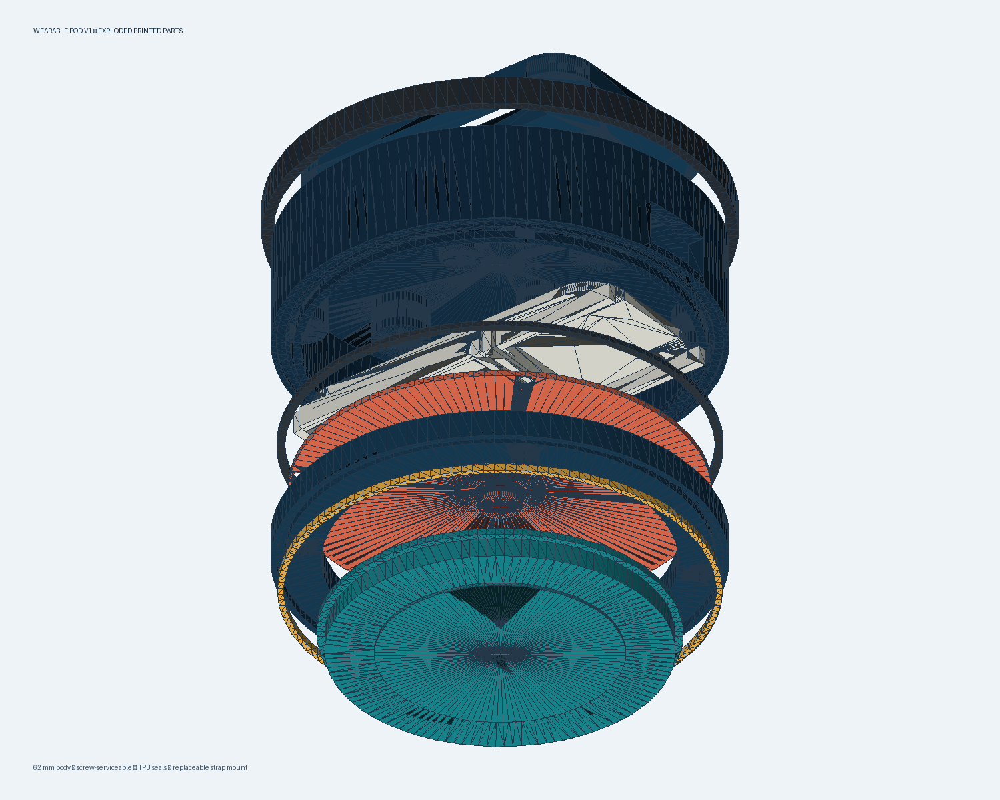
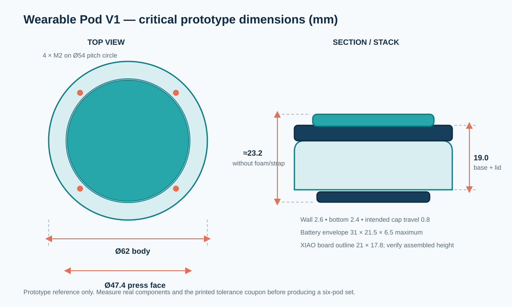

# Wearable Pod V1

A serviceable, parametric enclosure for one wearable Physical Social Games button.



## Design summary

- 62 mm nominal body diameter.
- 47.4 mm obvious press surface with approximately 0.8 mm intended travel.
- Four M2 screws into heat-set inserts for repeatable opening and closing.
- Tongue-and-groove shell alignment plus a replaceable TPU compression gasket.
- Captured button cap: it cannot fall out while the enclosure is closed.
- Separate TPU diaphragm for dust resistance and compliant button return.
- Removable electronics carrier for a 21 × 17.8 mm XIAO ESP32-C3 and a battery up to 31 × 21.5 × 6.5 mm.
- Separate USB-C and recessed power-switch openings.
- Replaceable two-screw strap plate with two 29 × 5 mm strap slots.
- Stretch-on TPU drop bumper.
- No glue is required to service the enclosure.

## Files

- [`generate_models.py`](generate_models.py) — editable parametric source.
- [`model-validation.json`](model-validation.json) — recorded mesh and mechanical-clearance checks.
- [`stl/`](stl/) — ten generated and watertight print files.
- [`preview/wearable-pod-v1-exploded.glb`](preview/wearable-pod-v1-exploded.glb) — interactive exploded 3D model.
- [`preview/critical-dimensions.svg`](preview/critical-dimensions.svg) — first-build dimensional reference.
- [`PRINTING.md`](PRINTING.md) — material, orientation, slicing, and tolerance guidance.
- [`ASSEMBLY.md`](ASSEMBLY.md) — complete opening, closing, and assembly process.
- [`DESIGN-DECISIONS.md`](DESIGN-DECISIONS.md) — why this closure and attachment method were selected.
- [`bom.csv`](bom.csv) — printed and purchased parts.

## Important assumptions

The official XIAO ESP32-C3 board outline is 21 × 17.8 mm, but connected wires, the external antenna, battery connector, and solder joints also need clearance. The battery envelope in this model is only a starting maximum. Measure the exact purchased cell and all assembled electronics with calipers before printing six housings.

The enclosure is not certified waterproof and must not be described with an IP rating. The gasket and diaphragm are prototype dust/splash-control features that require physical testing.



## Regenerating the files

```powershell
python -m pip install -r requirements.txt
python generate_models.py
```

The generator rejects parts that are not watertight, have inconsistent triangle winding, or have non-positive volume.

## References

- [Official Seeed Studio XIAO ESP32-C3 dimensions and resources](https://wiki.seeedstudio.com/XIAO_ESP32C3_Getting_Started/)
- [Project enclosure requirements](../../../manuals/chapters/13-3d-printable-enclosure-instructions.md)
- [Project industrial-design requirements](../../../manuals/chapters/12-industrial-design-manual.md)
